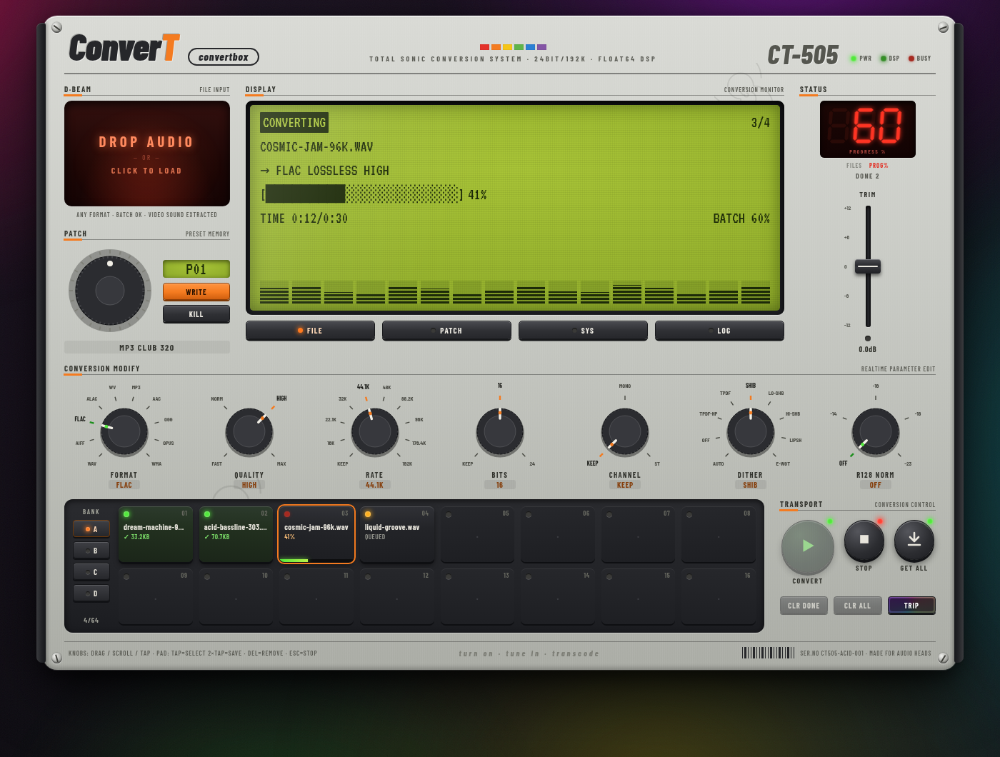

# ConverT · CT-505

**Total sonic conversion system.** A batch audio file converter that runs entirely in your
browser, dressed as a late-90s Roland groovebox and wired for audiophile-grade output.

Drop files on the D·BEAM, dial in a patch (format + quality + rate + depth + dither + loudness),
hit **CONVERT**, download the results — one by one or as a zip. Nothing ever leaves your machine:
the DSP core is FFmpeg compiled to WebAssembly, running locally.



## Quick start

```bash
npm install
npm run dev        # → http://localhost:5173
```

Production build (fully static, host anywhere or open via any static file server):

```bash
npm run build      # → dist/
npm run preview
```

## The signal path (a.k.a. the gold cables)

Quality rules the arg builder (`src/audio/args.ts`) lives by:

- **Touch nothing unless the patch demands it.** Same rate, same depth, no gain, no norm →
  samples pass through untouched. Lossless→lossless with no DSP earns the `BIT PERFECT` badge.
- **64-bit float DSP.** Whenever the filter chain runs, swresample is pinned to `dblp`
  internal processing.
- **Serious resampling.** libsoxr at 28-bit precision when the core has it; otherwise
  swresample with a 256-tap filter (`filter_size=256:cutoff=0.97`) — far beyond stock settings.
  Family-preserving rate coercion (96k→48k, 88.2k→44.1k) keeps ratios clean when a lossy
  format can't hold the source rate.
- **Noise-shaped dither, only when it's real.** Reductions to 16-bit get TPDF-HP or Shibata
  noise shaping (auto-picked per rate, selectable on the DITHER knob). No dither is ever
  applied where it doesn't belong — 24-bit targets and lossy encodes stay clean.
- **Two-pass EBU R128 loudness** (optional, off by default). Measure pass then linear-mode
  `loudnorm` with measured values, output rate pinned. Targets: -14 / -16 / -18 / -23 LUFS.
- **MP3 at maximum effort.** `libmp3lame` runs at `-compression_level 0` (lame `-q0`) always.
- **Metadata + cover art travel along** wherever the target format can carry them.
- Honest badges on the LCD: `GEN LOSS!` for lossy→lossy, `LOSSY SRC` when "upgrading" to
  lossless, `DITHER SHIBATA`, `R128 -16LU`, …

## Formats

| Target | Container | Depths | Quality control |
| --- | --- | --- | --- |
| WAV | `.wav` (RF64 auto) | 16 / 24 / 32-float | — |
| AIFF | `.aiff` | 16 / 24 / 32-float | — |
| FLAC | `.flac` | 16 / 24 | compression 0–12 |
| ALAC | `.m4a` | 16 / 24 | — |
| WavPack | `.wv` | 16 / 24 / 32-float | compression fast→max |
| MP3 (LAME) | `.mp3` | — | CBR 128–320, V0/V2/V4 |
| AAC | `.m4a` | — | 96–320 kbps |
| Ogg Vorbis | `.ogg` | — | Q2–Q10 |
| Opus | `.opus` | — | 96–320 kbps¹ |
| WMA v2 | `.wma` | — | 64–192 kbps |

**Input:** anything FFmpeg can decode — the formats above plus APE, Musepack, TTA, AC3, DTS,
AMR, CAF, and the audio track of any video file (MP4/MKV/MOV/AVI/WebM…).

¹ libopus encoding crashes the current `@ffmpeg/core` wasm build (verified by
`scripts/e2e.mjs` history — "Error submitting audio frame to the encoder" → OOB), so Opus
currently uses FFmpeg's native CELT encoder. The format entry carries a note; swap `codec`
back to `libopus` in `src/audio/formats.ts` when the upstream core is fixed.

## Driving it

- **D·BEAM** — drop files anywhere on the page, or click to browse. Up to 64 files across
  pad banks A–D.
- **Knobs** — drag vertically, scroll, or tap to advance. `FORMAT` reshapes the other knobs'
  scales (only legal rates/depths for that codec are offered).
- **PATCH dial** — spin through 20 factory presets (`MP3 CLUB 320`, `FLAC CD 16/44`,
  `WAV HIRES 24/96`, `EBU -23 BROADCAST`, …). **WRITE** stores your current knob state as a
  user patch (persisted in localStorage); **KILL** deletes it.
- **CONVERT** — runs everything that isn't already converted with the current patch.
  Change the patch and press again to re-convert. **STOP** hard-cancels the DSP core.
- **Pads** — tap to inspect a file on the LCD, double-tap a lit pad to download that file,
  hover **×** (or `Del`) to remove.
- **GET ALL** — single file → direct download; multiple → zip.
- **LCD pages** — FILE / PATCH / SYS / LOG. SYS toggles UI sound, auto-download and TRIP mode.
- **TRIP** — you'll know.

## Architecture

```
src/
├── audio/
│   ├── formats.ts        ← declarative format registry (add a format = add an entry)
│   ├── presets.ts        ← factory patches
│   ├── args.ts           ← audiophile FFmpeg arg builder (the gold cables)
│   ├── probe.ts          ← `ffmpeg -i` stderr → structured file info
│   └── engine/
│       └── ffmpegEngine.ts ← serialized ffmpeg.wasm engine behind a narrow interface
├── state/store.ts        ← zustand store + batch runner + persistence
├── ui/                   ← faceplate, LCD, knobs, pads, dial, transport, D·BEAM
└── util/                 ← formatting, downloads, zip
```

Extension seams, deliberately kept open:

- **New target format** → one entry in `FORMATS` (knobs, presets, LCD adapt automatically).
- **New DSP feature** (trim, fades, EQ, stems…) → extend `Preset` + the filter chain in `args.ts`.
- **Faster core** → `ffmpegEngine.ts` is the only file that knows about ffmpeg.wasm; a
  multithreaded core (COOP/COEP headers are already served) or a native/server backend can
  slot in behind the same interface.

## Testing

```bash
npm run build
npm run e2e
```

`scripts/e2e.mjs` generates real WAVs (44.1k/16 and 96k/24), boots the app in headless
Chromium, converts through five patches (FLAC keep / FLAC CD with Shibata dither / MP3 320 /
Opus / WAV 24-48 with two-pass R128), and byte-verifies output magic numbers and FLAC
STREAMINFO (rate, depth, channels). Screenshots land in `scripts/.artifacts/`.

## Roadmap ideas

Trim & fade knobs · per-file preset overrides · spectrum analyzer LCD page · drag-out
downloads · multithreaded core toggle · CD cue-sheet splitting · watch-folder via the
File System Access API · MIDI control (a real MC-505 as the controller — obviously).
