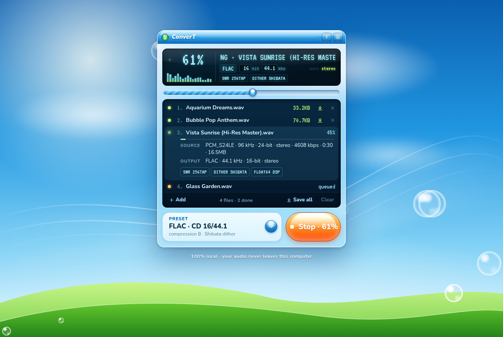
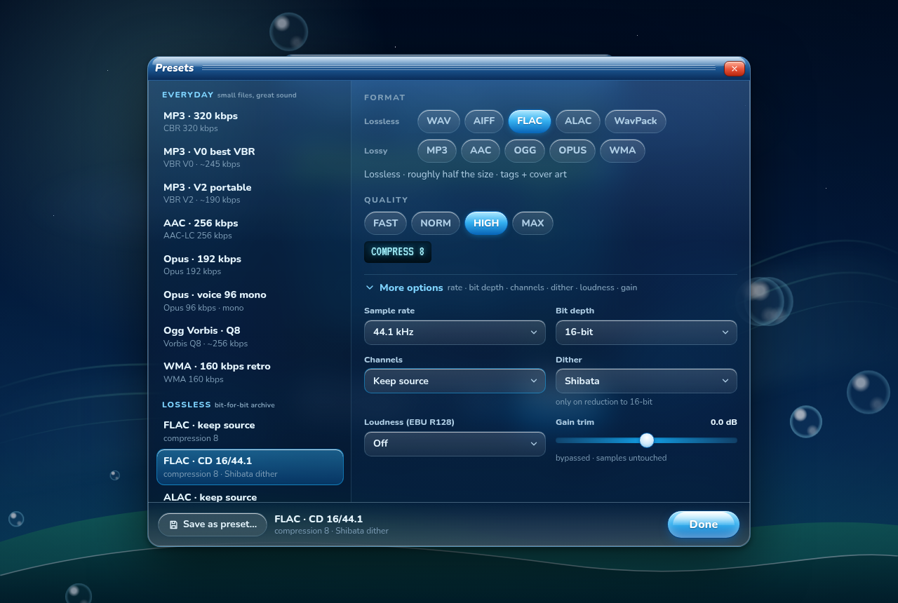

# ConverT

**Audiophile-grade audio conversion, in a glossy little media-player window.**
Drop a file, pick a preset, press **Convert** — the converted file downloads. Batches arrive
as one zip. Everything runs inside your browser: the DSP core is FFmpeg compiled to
WebAssembly, so nothing is ever uploaded.

The look is Frutiger Aero by way of a Winamp skin: aqua gel buttons, smoked-glass display
with a scrolling marquee, kbps/kHz readouts and a little analyzer, all floating over a
bubbly sky. Two skins — **Aqua Day** and **Aurora Night**.



## Quick start

```bash
npm install
npm run dev        # → http://localhost:5173
```

Production build (fully static, host anywhere or open via any static file server):

```bash
npm run build      # → dist/
npm run preview
```

### Deploying (GitHub Pages)

The repo is **source code** — Pages must serve the *built* `dist/`, never the repo root
(serving raw `src/main.tsx` is how you get a blank white page — which is also why there is
no Jekyll workflow here). `.github/workflows/deploy.yml` builds the app and publishes `dist/`
to Pages on every push to the deploy branch.

One-time setup, if the workflow's auto-enable step is blocked: repo **Settings → Pages →
Build and deployment → Source: “GitHub Actions”**. After a green run the app lives at
`https://<user>.github.io/ConverT/`. The Vite `base` is relative (`'./'`), so the same
build also works at a domain root or any other subpath; `scripts/pages-smoke.mjs` boots
the built app under a simulated `/ConverT/` prefix and runs a conversion to guard this.

## Using it

The main window holds exactly four things:

1. **Display** — big digits (total length, or batch % while converting), a scrolling marquee,
   what the output will be (`MP3 · 320 kbps · 44.1 khz · stereo`) and quality badges for the
   file in focus.
2. **File list** — drop files anywhere on the page (or click the drop bubble). Up to 64 files,
   any format, even the audio track of a video. Click a file for its details; ↓ re-downloads,
   × removes.
3. **Preset** — opens the preset pop-up (below). Whatever you leave selected is what you get
   next time you open the app.
4. **Convert** — converts everything that isn't already converted with this preset, then
   downloads it: one file → the file, a batch → one zip. While running it's **Stop**; when
   everything's done it's **Save** (download again). Change the preset and it's **Convert**
   again.

**Preset pop-up.** Left: the library — *Everyday* (MP3/AAC/Opus/Vorbis/WMA), *Lossless*,
*Studio & Hi-Res*, *Loudness*, and *My presets*. Right: dial it in — tap a **format**, tap a
**quality**, done. **More options** opens sample rate, bit depth, channels, dither, EBU R128
loudness and gain trim. **Save as preset…** stores the current settings in *My presets*.
Double-click a library preset to apply and close.

**Options (⚙).** Auto-download on/off, batches-as-zip on/off, skin, animated sky, interface
sounds, engine status and log. **Help (?)** explains the badges.

Keys: `Esc` closes a pop-up or stops a batch · `Del` removes the focused file.



## The signal path (a.k.a. the gold cables)

Quality rules the arg builder (`src/audio/args.ts`) lives by:

- **Touch nothing unless the patch demands it.** Same rate, same depth, no gain, no norm →
  samples pass through untouched. Lossless→lossless with no DSP earns the `BIT PERFECT` badge.
- **64-bit float DSP.** Whenever the filter chain runs, swresample is pinned to `dblp`
  internal processing.
- **Serious resampling.** libsoxr at 28-bit precision when the core has it; otherwise
  swresample with a 256-tap filter (`filter_size=256:cutoff=0.97`) — far beyond stock settings.
  Family-preserving rate coercion (96k→48k, 88.2k→44.1k) keeps ratios clean when a lossy
  format can't hold the source rate.
- **Noise-shaped dither, only when it's real.** Reductions to 16-bit get TPDF-HP or Shibata
  noise shaping (auto-picked per rate, selectable on the DITHER knob). No dither is ever
  applied where it doesn't belong — 24-bit targets and lossy encodes stay clean.
- **Two-pass EBU R128 loudness** (optional, off by default). Measure pass then linear-mode
  `loudnorm` with measured values, output rate pinned. Targets: -14 / -16 / -18 / -23 LUFS.
- **MP3 at maximum effort.** `libmp3lame` runs at `-compression_level 0` (lame `-q0`) always.
- **Metadata + cover art travel along** wherever the target format can carry them.
- Honest badges on the display: `GEN LOSS!` for lossy→lossy, `LOSSY SRC` when "upgrading" to
  lossless, `DITHER SHIBATA`, `R128 -16LU`, …

## Formats

| Target | Container | Depths | Quality control |
| --- | --- | --- | --- |
| WAV | `.wav` (RF64 auto) | 16 / 24 / 32-float | — |
| AIFF | `.aiff` | 16 / 24 / 32-float | — |
| FLAC | `.flac` | 16 / 24 | compression 0–12 |
| ALAC | `.m4a` | 16 / 24 | — |
| WavPack | `.wv` | 16 / 24 / 32-float | compression fast→max |
| MP3 (LAME) | `.mp3` | — | CBR 128–320, V0/V2/V4 |
| AAC | `.m4a` | — | 96–320 kbps |
| Ogg Vorbis | `.ogg` | — | Q2–Q10 |
| Opus | `.opus` | — | 96–320 kbps¹ |
| WMA v2 | `.wma` | — | 64–192 kbps |

**Input:** anything FFmpeg can decode — the formats above plus APE, Musepack, TTA, AC3, DTS,
AMR, CAF, and the audio track of any video file (MP4/MKV/MOV/AVI/WebM…).

¹ libopus encoding crashes the current `@ffmpeg/core` wasm build (verified by
`scripts/e2e.mjs` history — "Error submitting audio frame to the encoder" → OOB), so Opus
currently uses FFmpeg's native CELT encoder. The format entry carries a note; swap `codec`
back to `libopus` in `src/audio/formats.ts` when the upstream core is fixed.

## Architecture

```
src/
├── audio/
│   ├── formats.ts        ← declarative format registry (add a format = add an entry)
│   ├── presets.ts        ← factory library, shelves, plain-language preset descriptions
│   ├── args.ts           ← audiophile FFmpeg arg builder (the gold cables)
│   ├── probe.ts          ← `ffmpeg -i` stderr → structured file info
│   └── engine/
│       └── ffmpegEngine.ts ← serialized ffmpeg.wasm engine behind a narrow interface
├── state/store.ts        ← zustand store, batch runner, delivery (file/zip), persistence
├── ui/
│   ├── Player.tsx        ← the main window
│   ├── Sky.tsx           ← Frutiger Aero background
│   ├── components/       ← display, file list, preset pill + convert button, fields, icons
│   └── popups/           ← Presets, Options, Help (shared glass Window shell)
├── styles/               ← base (tokens + both skins), sky, player, popups
└── util/                 ← formatting, downloads, zip
```

Extension seams, deliberately kept open:

- **New target format** → one entry in `FORMATS` (preset window, display and arg builder adapt).
- **New DSP feature** (trim, fades, EQ, stems…) → extend `Preset` + the filter chain in
  `args.ts`, add a control to *More options* in `PresetWindow.tsx`.
- **New skin** → one `:root[data-skin='…']` token block in `styles/base.css` + a chip in Options.
- **Faster core** → `ffmpegEngine.ts` is the only file that knows about ffmpeg.wasm; a
  multithreaded core (COOP/COEP headers are already served) or a native/server backend can
  slot in behind the same interface.

## Testing

```bash
npm run build
npm run e2e        # DSP byte checks + real UI flow (pop-up → Convert → download)
npm run sweep      # every format must encode
npm run shots      # screenshots of every UI state → scripts/.artifacts/
npm run smoke:pages
```

`scripts/e2e.mjs` generates real WAVs (44.1k/16 and 96k/24), boots the app in headless
Chromium, converts through five presets (FLAC keep / FLAC CD with Shibata dither / MP3 320 /
Opus / WAV 24-48 with two-pass R128), and byte-verifies output magic numbers and FLAC
STREAMINFO (rate, depth, channels). Then it drives the actual UI: opens the preset pop-up,
taps a format and quality, presses Convert and checks the browser download (a valid `.mp3`
for one file, a two-entry `.zip` for a batch), and reloads to confirm the preset was remembered.

## Roadmap ideas

Trim & fade options · per-file preset overrides · real spectrum analyzer on the display ·
drag-out downloads · multithreaded core toggle · CD cue-sheet splitting · watch-folder via the
File System Access API · more skins.
